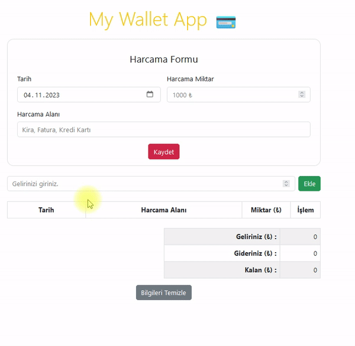

# Wallet App

This is a Wallet app built with JavaScript and styled using Bootstrap. It utilizes advanced DOM manipulation techniques and local storage to store user data. With this app, users can easily track their expenses and incomes, and see the accumulated summary.

## Authors

- [Nursaadet](https://github.com/Nursaadet)

## Demo
https://nursaadet.github.io/my-wallet-app/

## 📸 Demo GIF
[]

## Features

- Expense Tracking: Users can enter their expenses including the expense quantity and date.
- Income Entry: Users can also enter their income data.
- Accumulated Sum: The app calculates and displays the accumulated sum of expenses and incomes.

## Tech Stack

**Client:** 
JavaScript
Bootstrap
HTML
